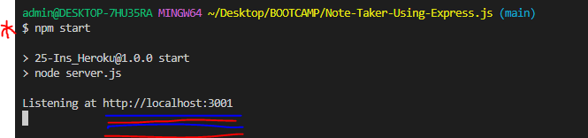

# Note-Taker-Using-Express.js

## Description 

This project is a Note Taker that uses Express.js on the back end to save and retrieve note data from a JSON file.

While I cannot take credit for the front end, it is the Express.js that I created that gives this application its power.

When a user opens the Note Taker, they are presented with a landing page with an entry link.

Once the user enters the main screen, they can easily enter a subject, add notes, save that note, view previous notes, and/or delete notes.

[**Check out the application here!**](https://t-notetaker.herokuapp.com/)

## Technology Used 

|  

## Table of Contents

  - [**Description**](#description)
  - [**Installation**](#installation)
  - [**Usage**](#usage)
  - [**Contribution**](#contributing)
  - [**Testing**](#tests)
  - [**Author Info**](#author-info)
  - [**License**](#license)

## Installation

The Note-Taker runs with Express.js and uses Heroku as its deployment platform. After installing the dependencies, open the terminal in the root folder and enter "npm start" at the command-line. The application will start and give you the local host link. If you 'ctrl + click' on the link, it will take you to the Note Taker application. 

## Usage 

The user begins at the entry page (pictured above in the description) and then clicks the "Get Started" button.

They are then directed to the main entry screen shown here:

Then separate entries can be made and saved:

If a task is completed or the information is no longer needed, then the notes can be individually deleted:

## Learning Points 
I learned how to utilize Express.js for this project. 

It was necessary to investigate how the provided code needed to be used in conjunction with the javascript.

For example, in order for the proper html to load, the correct request needed to be made using the Express.js syntax for 'GET', 'POST', and 'DELETE'.

I challenged myself to code the 'DELETE' request for my application. I am very pleased that it works, although when each note is deleted, an error does appear in the console log until the screen is refreshed. I worked with 3 tutors to try and determine the root of the issue, but we were unable to determine the solution. As these were bonus points anyway, I added this problem to my list of to-dos for when the cohort has completed.

## Author Info
My name is Tamara "T" Dusenbury
If you have any questions about me or this project, please contact me:
  
- [**Github**](https://github.com/tdusenbury)

- [**LinkedIn**](https://linkedin.com/in/tamara-dusenbury-02ab8591)

- [**Email**](mailto:tamara.dusenbury@gmail.com)

## Credits

Shout outs to my whole cohort for great classes, but especially to an amazing study group!!! You know it was a curly bracket!!!!

## Contributing

If you would like to contribute, please follow the [Contributor Covenant](https://www.contributor-covenant.org/).

## License

This projects holds an MIT License.